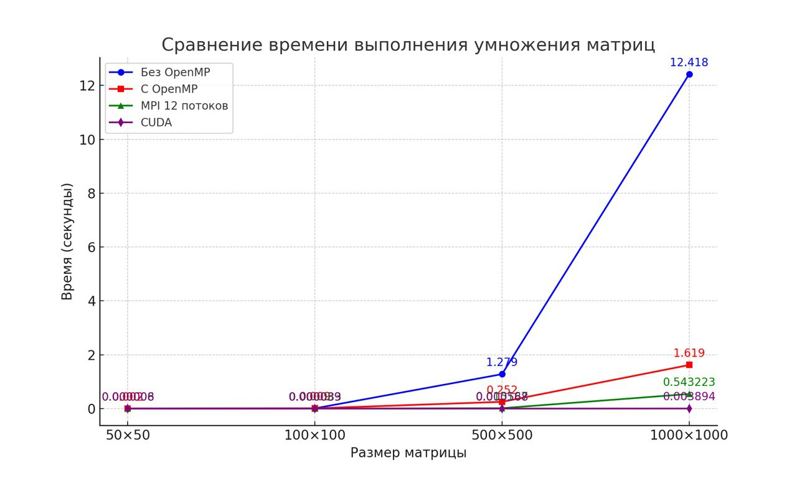

# Умножение матриц с помощью технологии OpenMP

## Описание
Данный проект представляет собой реализацию алгоритма умножения матриц по технологии CUDA ОТ Nvidia. 
## Проверка
Проверка производится с использованием библиотеки numpy в файле verify.py

## Результаты
Записаны в файл result.txt и info.txt

| Размер      | Время выполнения (сек) без OpenMP | Время выполнения (сек) с OpenMP | Время выполнения (сек) с MPI(12 потоков) | Время выполнения (сек) с CUDA Nvidia |
|-------------|-----------------------------------|---------------------------------|------------------------------------------|--------------------------------------|
| 50x50       | 0.0012598                         | 0.0015021                       | 0.0000058732                             | 0.00000769                           | 
| 100x100     | 0.0091451                         | 0.0041557                       | 0.0000827876                             | 0.00003945                           |
| 500x500     | 1.27878                           | 0.251998                        | 0.0151869                                | 0.00056812                           |
| 1000x1000   | 12.4177                           | 1.61884                         | 0.543223                                 | 0.00389351                           |

## Вывод 
С помощью технологии CUDA врменные результаты умножения матриц стали намного лучше и эффективней.
